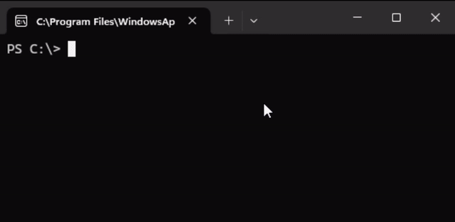

# Apple II Languages for Neovim

## Overview

This plugin provides language support for the following languages:

* Integer BASIC
* Applesoft BASIC
* Merlin Assembly

These were commonly used with the Apple II line of computers.



## Features

* highlights, diagnostics, hovers, completions, symbols
* disk image access
* renumbering and minification of BASIC
* disassemble binaries to Merlin source code
* settings for Merlin version and processor target

See [Tips](#tips) and [Commands](#commands) for more.

## Installation

1. Install Neovim version 0.10.1 or higher
2. Install `a2kit` version 3.4.0 or higher
    - Install/update the rust toolchain as necessary
    - Run `cargo install a2kit` in the terminal
    - Make sure `~/.cargo/bin` is in the path (usually automatic)
2. Install the plugin.  The procedure varies depending on plugin manager.  See examples.
3. Test it by moving the cursor over some keyword in an Apple II source file, and pressing `K` (case matters) in normal mode.  You should get a hover.  If the color scheme is not rendered properly, try installing a better terminal program, or a Neovim GUI.

The plugin does not verify client or server versions.  Please check using `nvim -v` and `a2kit -V` (case matters).

### rocks.nvim example

For [rocks.nvim](https://github.com/nvim-neorocks/rocks.nvim), enter Neovim and issue commands:

1. `:Rocks install rocks-config.nvim` (adds ability to configure plugins)
2. `:Rocks install tokyonight.nvim` (color scheme, substitute your favorite)
3. `:Rocks install nvim-a2-pack`

Notes:

* Color scheme is not automatically made the default, see [Settings](#settings).
* As of this writing, using `rocks.nvim` with Windows is challenging.

### lazy.nvim example

For [lazy.nvim](https://github.com/folke/lazy.nvim) you add a line to your spec file.  A minimal example of this file follows.

```lua
--- LAZY.NVIM SPEC FILE
--- This file can be named anything.lua.
--- For Windows this goes in ~\AppData\Local\nvim\lua\plugins.
--- For others this goes in ~/.config/nvim/lua/plugins.
return {
  -- add a color scheme if not already done
  {
    "sho-87/kanagawa-paper.nvim",
    lazy = false,
    priority = 1000,
    config = function()
      -- make it the default
      vim.cmd.colorscheme('kanagawa-paper')
    end,
  },

  -- add this plugin
  { "dfgordon/nvim-a2-pack", opts = {} },
}
```

## File Types

* Integer BASIC is triggered by `*.ibas`
* Applesoft BASIC is triggered by `*.bas` or `*.abas`
* Merlin assembly is triggered by `*.s` or `*.asm`
  - Only `*.s` files are detected by the workspace scanner

## Settings

Changing settings means changing a Lua map (this is the way of Neovim).  Some of the available map keys can be found [here](https://github.com/dfgordon/a2kit/wiki/Languages#configuration-options). Translate the key paths to Lua maps in the obvious way.

### rocks.nvim example

Assuming you are not on Windows, create a file `~/.config/nvim/lua/plugins/a2-pack.lua` with the settings.  Example:

```lua
require('nvim-a2-pack').setup {
    merlin6502 = {
        version = "Merlin 32"
        -- ... other settings
    }
    -- ... other languages
}
```

You can also use this approach to set the default color scheme, e.g., create `~/.config/nvim/lua/plugins/tokyonight.lua` with content

```lua
-- set color scheme options
require('tokyonight').setup {
  style = "day"
}
-- make it the default
vim.cmd.colorscheme('tokyonight')
```

### lazy.nvim example

Modify the spec file to include the options.  Example:

```lua
--- LAZY.NVIM SPEC FILE
return {
  -- ...omitting other plugins...
  {
    "dfgordon/nvim-a2-pack",
    opts = {
      merlin6502 = {
        version = "Merlin 32"
        -- ... other settings
      }
      -- ... other languages
    }
  }
}
```

## Completions

The language servers provide completions and snippets.  To gain these capabilities in Neovim you have to configure some plugins.  This can get pretty involved.  Here is an example using [lazy.nvim](https://github.com/folke/lazy.nvim).

```lua
--- LAZY.NVIM SPEC FILE
return {
  -- ...omitting other plugins...
  {
    "hrsh7th/nvim-cmp",
    -- load cmp on InsertEnter
    event = "InsertEnter",
    -- these dependencies will only be loaded when cmp loads
    -- dependencies are always lazy-loaded unless specified otherwise
    dependencies = {
      "hrsh7th/cmp-nvim-lsp",
      "hrsh7th/cmp-buffer",
      "neovim/nvim-lspconfig",
      "L3MON4D3/LuaSnip"
    },
    config = function ()
	    local cmp = require("cmp")
	    cmp.setup({
		    mapping = cmp.mapping.preset.insert({
			    ['<C-b>'] = cmp.mapping.scroll_docs(-4),
			    ['<C-f>'] = cmp.mapping.scroll_docs(4),
			    ['<C-o>'] = cmp.mapping.complete(),
			    ['<C-e>'] = cmp.mapping.abort(),
			    ['<CR>'] = cmp.mapping.confirm({select = true}),
		    }),
		    snippet = {
			    expand = function(args)
				    require('luasnip').lsp_expand(args.body)
			    end
		    },
		    sources = cmp.config.sources({
			    { name = 'nvim_lsp' },
			    { name = 'luasnip' },
        -- for more aggressive completions uncomment the following lines
		    --}, {
			  --  { name = 'buffer' },
		    })
	    })
    end
  },
}
```
## Tips

* Start commands with `:A2`, from there you can tab-complete your way
* When completing a path, enter slash after subdirectory selection, then tab again
  - Always use forward slash to form paths
  - Backslash is used for escapes (esp. spaces)
  - It works on disk images too!
* You can use `K` on a wide range of language elements
  - BASIC keywords, processor instructions, psuedo-operations
  - special addresses like soft switches, ROM routines, ZP locations, etc.
  - macro references will show the macro expansion
  - BASIC line number references, or Merlin label references, will show the docstring
* Ctrl-`]` works on BASIC line number references as well as Merlin labels
* Format Merlin columns with `gq`
* When editing Merlin sources, be aware of the workspace scanner
  - Deep project roots can impact both performance and accuracy
  - Scanner passes over `build`, `node_modules`, and `target` directories
  - The project root is found by looking for `.git`.  The current working directory is the fallback.

## Commands

All commands associated with this plugin begin with `:A2`.  Subcommands are as follows.

### `:A2 asm`

Convert code to data.  This will first assemble the code, then re-express it as Merlin pseudo-operations such as `HEX`, `ASC`, `DCI`, `DS`, and others.  First select the lines to be converted, then issue the command.

It is sometimes necessary to add a program counter hint.  This can be done with the `ORG` pseudo-operation, or by adding a label of the form `_XXXX`, where `X` is a hex digit.

This is by no means a full assembler, its purpose is to help with disassembly.

### `:A2 dasm`

Convert data to code.  This is useful for reversing some prior decision to interpret as data.  First select the lines to be converted, then issue the command.

It is sometimes necessary to add a program counter hint.  This can be done with the `ORG` pseudo-operation, or by adding a label of the form `_XXXX`, where `X` is a hex digit.

To disassemble a whole file see `:A2 load`.

### `:A2 load <path>`

This loads a file from the currently mounted disk image into the current buffer for editing.  Tab completion shows files based on buffer's filetype:

* `applesoft`: directories and Applesoft programs are shown.
* `integerbasic`: directories and Integer BASIC programs are shown.
* `merlin`: directories, text files, and binary files are shown.  Text files will be decoded as Merlin source.  Binary files will be disassembled as Merlin source.

You can try to load any file by directly typing its name, but in order to get meaningful results, the contents must be in the expected format.

### `:A2 minify [level]`

This reduces the size of an Applesoft program by stripping comments, keeping only the two significant characters in variables, and stripping unnecessary separators.  Level 1 and level 2 are currently the same.  Level 3 will truncate variable names that occur inside ampersand commands.  The minified program is opened in a new window.

### `:A2 mount <path>`

Before any disk image can be accessed it has to be mounted using this command.  This tells the active language server to solve and buffer the disk image.  Each server will only mount one disk image at a time, i.e., mounting a new disk image unmounts the old one.

### `:A2 renumber <start> <step>`

This renumbers the BASIC program in the current buffer.  If there is no selection, the whole document is renumbered.  If there is a selection, the primary line numbers are renumbered only in the selection, but references are still updated throughout the whole document.  This will change row ordering if necessary, unless there would be interleaving or colliding lines, in which case an error is returned.

### `:A2 save <path>`

This saves a file from the current buffer to the currently mounted disk image.  Tokenization is automatic.  Type of tokenization is based on the buffer's filetype.  If the file exists the user must respond to a warning.

**caveat**: If diagnostics show syntax errors, please resolve them before saving to a disk image.

### `:A2 tokenize [address]`

This produces a hex dump of the tokenized version of the BASIC program in the current buffer, mainly for inspection purposes.  For Applesoft, the `address` option is the starting address, and affects the actual tokens.  For Integer, the `address` is the ending address, and only affects the display.

## Notable Non-Dependencies

Neither `lspconfig` nor `nvim-treesitter` are needed by this plugin.

If you want syntax highlights without LSP, you could in theory use `nvim-treesitter`.  The required parsers exist.  However, Merlin requires the LSP for the most accurate highlights.

As of this writing, `a2kit` language servers are not registered with `lspconfig`.

